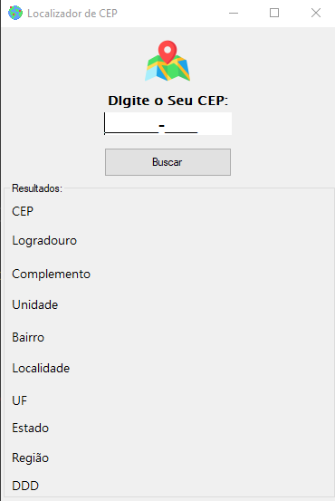

#  🗺 Localizador de CEP em C# 

Um pequeno Software que permite fazer pesquisar rápidas atraves do CEP digita pelo usuario obtendo varias informações atraves da API do site [ViaCEP](https://viacep.com.br/)

# Como funciona ❓
O usuario digita um CEP Válido e o algoritmo envia esse CEP para url do [ViaCEP](https://viacep.com.br/) e é retornado para o usuario as informações detalhadas sobre o local.

## Demonstração 📸

